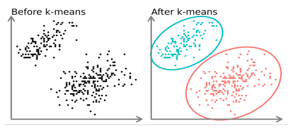

# <p align="center">School Project</p>

## School and Course


[Instituto Superior Técnico](https://tecnico.ulisboa.pt/)

[Engenharia Informática e de Computadores](https://tecnico.ulisboa.pt/en/education/courses/undergraduate-programmes/computer-science-and-engineering/)

## Class Subject and Goals
### Class: [IAC](https://fenix.tecnico.ulisboa.pt/cursos/leic-t/disciplina-curricular/1408903891910861) - Introduction to Computer Architecture
### Goals

- Assembly language
- numeric bases; binary and hexadecimal arithmetic operations; numeric and alphanumeric codes.
- Combinatory circuits: introduction to Boolean algebra; basic logic gates; decoders; multiplexers.
- Sequential circuits: registers and register-banks; memories; separation between datapaths and control units.
- Instruction set architecture (ISA): typical instructions; addressing modes; stack and routines; interrupts.
- Architecture of a processor: basic instruction cycle; notion of program counter and address; internal structure of a processor; instruction encoding; flags; special registers; datapath; register-bank; arithmetic logic unit (ALU); control unit; analysis of instruction execution.
- Memory system: addressing; caches; basic notions of virtual memory. Inputs/outputs.
 
### Grade: 20/20 


## Problem Specification

The aim of the project is to develop, in RISC-V assembly, a program that, given an initial set of	initial set of points in a two-dimensional (2D) space, identifies groups of points,	taking into account the relative proximity of the points in each group.	To do this the iterative k-means algorithm will be implemented.



This algorithm is widely used in applications in different domains - from computer vision	from computer vision, machine learning, intrusion detection in cybersecurity, to astronomy.	For these applications to be effective, it is essential that the implementation of the	k-means algorithm be efficient

Our final program takes the following main inputs:
- points, a vector of points in a 2D space (each point consists of a pair of	chords, {x,y});
- n, the number of points, i.e. the dimension of the points vector;
- k, the number of clusters to consider, i.e. the k parameter of the k-means algorithm.
- l, the maximum number of iterations of the algorithm.	
Based on these elements, the k-means algorithm is run only once.	
the optimization of running multiple instances of the algorithm and choosing the one that minimizes the variance.	the one that minimizes variance.

During execution, the k clusters and their respective centroids should be displayed on a screen as colored dots (with k different colors) in a 2D matrix.
As each iteration is calculated and adjusts the clusters and their centroids,	this information is updated on the screen.

## Setup
The code was written and ran in a simulator called Ripes. You need to install it first.

### Windows
 1. Go to [Ripes Github](https://github.com/mortbopet/Ripes/releases/)
 2. Download the version for your OS.
 3. Run ```Ripes.exe```

Trouble Shooting:
Errors “msvcp140.dll error” or “msvcp140_1.dll error”, please install “Visual C++ Redistributable”.

### Linux
 1. Go to [Ripes Github](https://github.com/mortbopet/Ripes/releases/)

 2. Download the version for your OS.
 3. Open Terminal on the download folder, and run: ```chmod ug+x```
 4. Run ```./<name_folder_you_downloaded>``` probably something like 'Ripes-v2.2.6-linux-x86_64.AppImage'

 TroubleShooting:
 Error “dlopen(): error loading libfuse.so.2”, need to install fuse2:
 ```bash
sudo apt install libfuse2
```

5. Add Ripes to the program List(optional)
  5.1. Install AppImageLAuncher:
    ```bash
    sudo add-apt-repository ppa:appimagelauncher-team/stable
    sudo apt-get update
    sudo apt-get install appimagelauncher```
  5.2. Run Ripes ``` ./'Ripes-vXXXXXXXXXXXX.AppImage'
  5.3. AppImageLauncher will ask if you want to add Ripes to the program list, click yes.

## Run
Open Ripes

And Load the file k-means.s

Enjoy.


<h2>Credits</h2>

- Author: <a href="https://github.com/iribeirocampos" target="_blank">Iuri Campos</a>

<h2>Copyright</h2>
This project is licensed under the terms of the MIT license and protected by IST Honor Code and Community Code of Conduct. 

